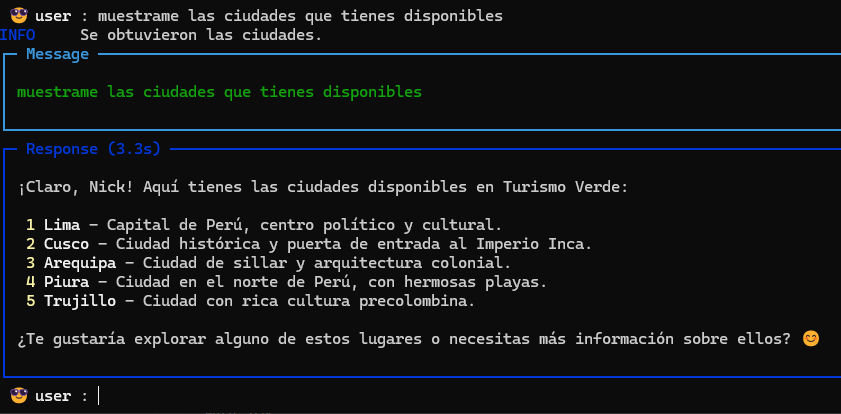
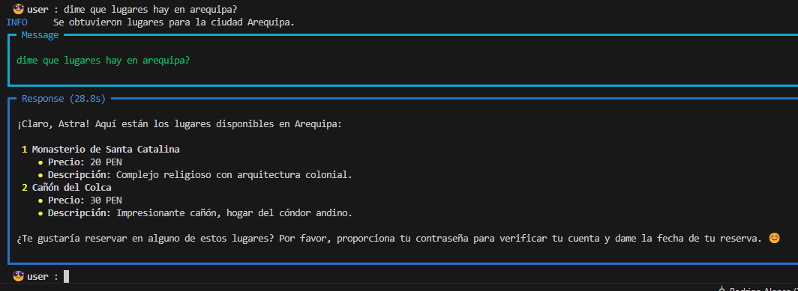
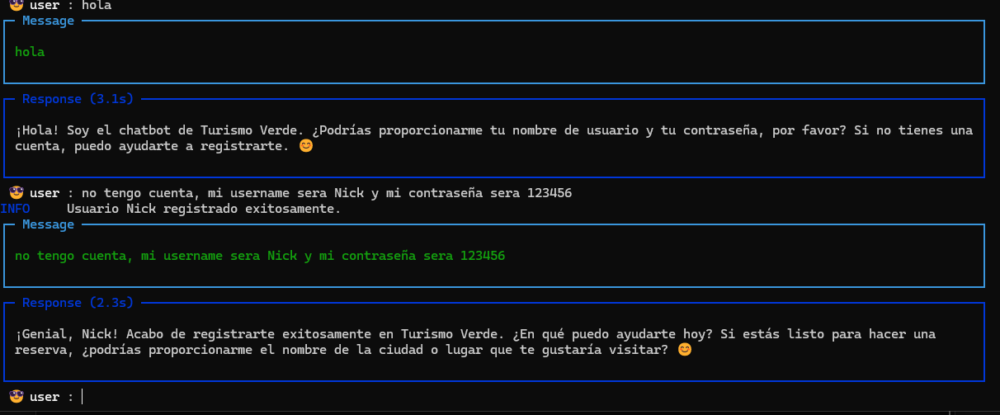
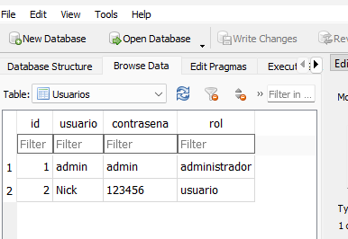

# Chatbot de Turismo Verde
Integrantes

Nick Jhilmar Ticona Ari

Shirley Estefany Ponce cuaquila

el repositorio original es: https://github.com/AstraDLCs/Chatbot-TurismoVerde

El **Chatbot de Turismo Verde** es un asesor entusiasta y persuasivo cuya única función es vender reservas para Turismo Verde. Con un lenguaje amigable, lleno de bromas y expresiones naturales, el bot guía al usuario en el proceso de consulta de ciudades y lugares turísticos, registro de usuario, verificación de credenciales y realización de reservas. Utiliza herramientas autorizadas que interactúan con una base de datos SQLite para asegurar una experiencia coherente y segura.

## Instalación
1. **Clonar el repositorio:**  
    Clona el repositorio con el siguiente codigo:
   ```bash
   git clone https://github.com/AstraDLCs/dr-avocado.git
   ```

2. **Moverse a la carpeta del proyecto:** 

    ```bash
   cd dr-avocado
   ```

3. **Resolver las dependencias:**  
   Instala todas las dependencias necesarias ejecutando:
   ```bash
   pip install -r requirements.txt
   ```

4. **Configurar la base de datos:**  
   Ejecuta el archivo `createdb.py` para crear la base de datos y cargar los datos de prueba:
   ```bash
   python createdb.py
   ```

5. **Ejecutar el chatbot:**  
   Una vez creada la base de datos, inicia el chatbot ejecutando:
   ```bash
   python chatbot.py
   ```

## Uso

Al iniciar el chatbot, este solicitará al usuario su nombre de usuario y contraseña para verificar sus credenciales. Si el usuario no está registrado, se le sugerirá registrarse. Posteriormente, el chatbot utilizará las herramientas autorizadas para:

- Consultar la lista de ciudades y lugares turísticos.
  
    
    
  
- Registrar nuevos usuarios.
  
    
    

- Crear reservas y consultar las reservas realizadas.

¡Disfruta de una experiencia interactiva y natural con el Chatbot de Turismo Verde!
